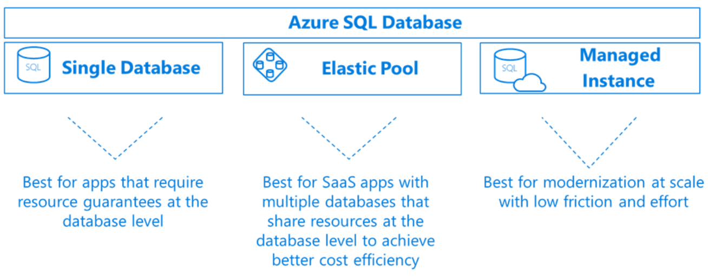
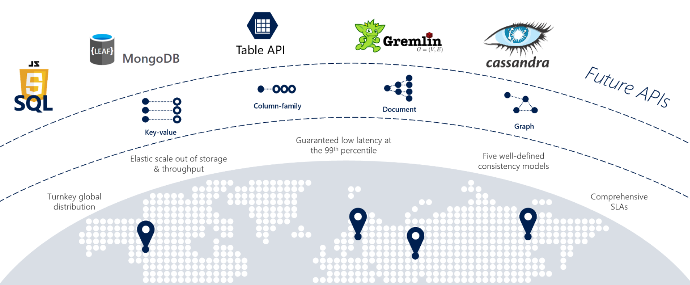
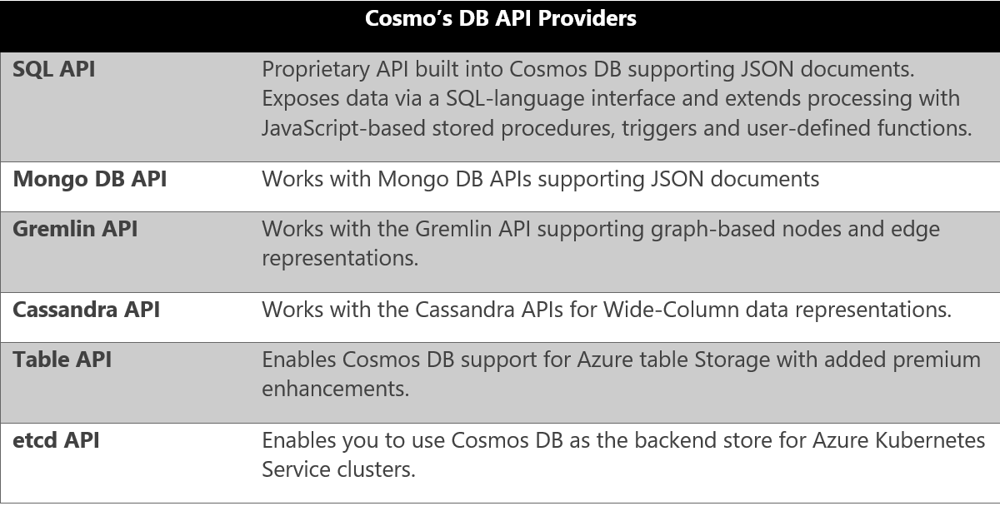
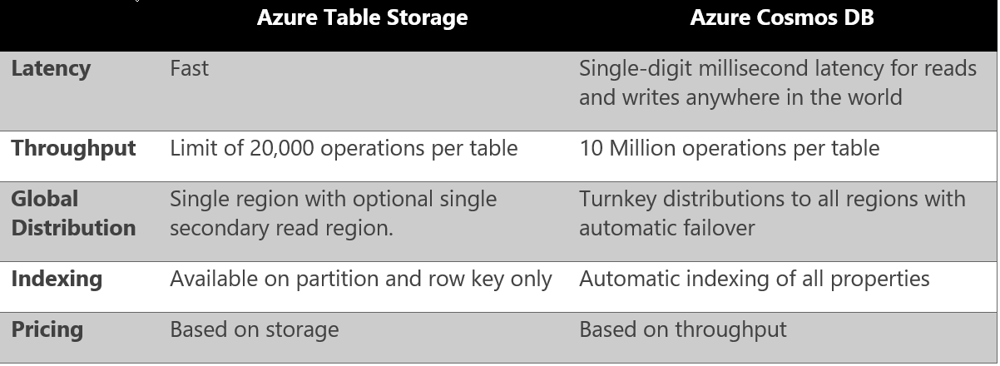
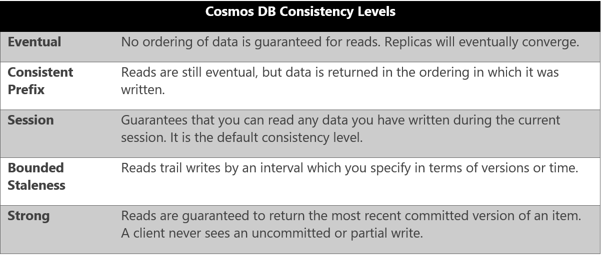
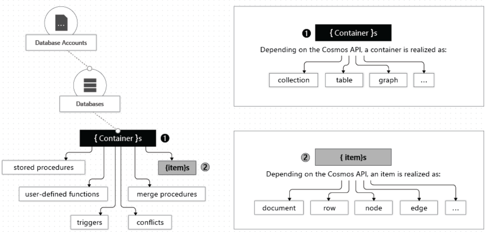
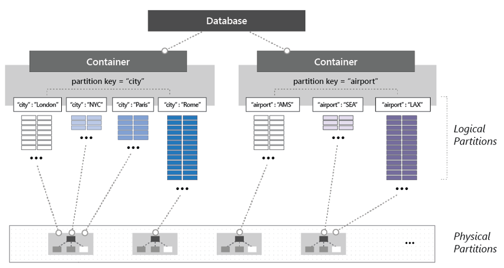
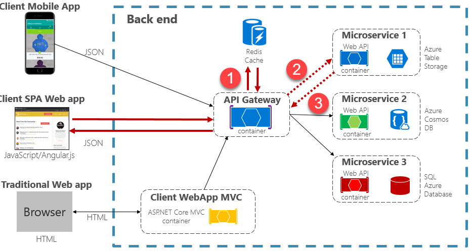

# Data storage in Azure

As we seen throughout this book, the cloud is changing the way applications are designed, deployed and managed. When moving there, a critical question is what do we do about our data? Fortunately, the Azure cloud provides many options.

You could simply provision a virtual machine and install your database of choice. While such an [Infrastructure as a Service (IaaS)](https://www.techopedia.com/definition/141/ infrastructure-as-a-service-iaas) approach might facilate moving an on-premises database into the cloud as-is, it would put the burden of managing the virtual machine and the database onto you.

A more popular approach is that of a fully-managed [Database as a Service (DBaaS)](https://www.stratoscale.com/blog/dbaas/what-is-database-as-a-service/) experience. You get a plethora of features and functionality while the hosting, maintenance and licensing by managed by Microsoft. Azure features a wide variety of fully-managed data storage options, each with specific benefits. They all support a just-in-time capacity and a pay-as-you-go model.

Here, we’ll fly over many of the key data services that are available in Azure. As you will soon see, Microsoft continues is commitment to making Azure an “open platform,” offering managed support for numerous open-source relational and NoSQL databases and making key contributions to the various open-source foundations as an active member.

## Azure SQL Database

[Azure SQL Database](https://docs.microsoft.com/en-us/azure/sql-database/) is a feature-rich, general-purpose relational database-as-a-service (DBaaS) based on the latest stable version of Microsoft SQL Server Database Engine. Fully managed by Microsoft, SQL Database is a high-performance, reliable, and secure cloud database. The service shares many of the features found in the on-premises SQL Server. 

You can provision a SQL Database server and database in minutes. When demand for your underlying app grows from a handful of devices and customers to millions, Azure SQL Database scales on the fly with minimal downtime. Its scalability features enables you to dynamically add or remove resources including CPU power, memory, IO throughput, and storage allocated to your databases.

Figure 5-12, show below, depicts the deployment options for Azure SQL Database.

**Figure 5-12**. Azure SQL Deployment Options

The alternatives in the figure above include deploying a SQL Database as a…

-   [Single
    database](https://docs.microsoft.com/en-us/azure/sql-database/sql-database-single-database) with its own set of resources managed via a SQL Database server. A single database is similar to a [contained database](https://docs.microsoft.com/sql/relational-databases/databases/contained-databases) in an on-premises SQL Server deployment.

-   [Elastic
    pool](https://docs.microsoft.com/en-us/azure/sql-database/sql-database-elastic-pool), which is a collection of databases with that share a single SQL Database server and the server resources at a set price. Single databases can be moved into and out of an elastic pool as needed to optimize the price performance for a group of databases.

-   [Managed
    instance](https://docs.microsoft.com/en-us/azure/sql-database/sql-database-managed-instance), which is a collection of system and user databases which provides near- 100%    compatibility with an on-premises SQL Server. This option supports larger databases, up to 35 TB, and is placed inside of an [Azure Virtual Network](https://docs.microsoft.com/en-us/azure/virtual-network/virtual-networks-overview) for better isolation.

Azure SQL Database is a fully managed [Platform as a Service (PaaS) Database Engine](https://docs.microsoft.com/en-us/azure/sql-database/sql-database-paas) that handles many database management functions such as upgrading, patching, backups, and monitoring without user involvement. Azure SQL Database is always running on the latest stable version of SQL Server Database Engine and patched OS with 99.99% availability. One such feature, [active geo-replication](https://docs.microsoft.com/en-us/azure/sql-database/sql-database-active-geo-replication), enables you to create readable secondardy databases in the same or different Azure data center. Upon failure, a failover to a secondary database in a different Azure region can be initiated. At that point, the other secondaries are automatically linked to the new primary. Up to four secondaries are supported in the same or different regions, and secondaries can also be leveraged for read-only access queries.

Azure SQL Database includes a wealth of [built-in monitoring and intelligent tuning](https://docs.microsoft.com/en-us/azure/sql-database/sql-database-monitoring-tuning-index) that can help you maximize performance and help reduce operational costs. For example, the [Automatic Tuning](https://docs.microsoft.com/en-us/azure/sql-database/sql-database-automatic-tuning) feature provides continuous performance tuning based on AI and machine learning. The service learns from the running workloads and can apply tuning recommendations. The longer an Azure SQL Database runs with automatic tuning enabled, the better it performs.

[Azure SQL Database serverless](https://docs.microsoft.com/en-us/azure/sql-database/sql-database-serverless) (available for preview as of the writing of this book) is a compute tier for single databases that automatically scales compute based on workload demand and bills for the amount of compute used per second. The serverless compute tier also automatically pauses databases during inactive periods when only storage is billed and automatically resumes databases when activity returns.

Finally, there is the new [Azure SQL Database Hyperscale](https://azure.microsoft.com/services/sql-database/) pricing tier. Powered by a highly scalable storage architecture, it enables a database to grow as needed, effectively eliminating the need to pre-provision storage resources. You can scale compute and storage resources independently, providing flexibility to optimize performance for workloads. Azure SQL Database Hyperscale is optimized for OLTP and high throughput analytics workloads with storage up to 100TB.  With read-intensive workloads, Hyperscale provides rapid scale-out by provisioning additional read replicas as needed for offloading read workloads. 

Moving beyond the traditional Microsoft SQL Server stack, Azure also features managed versions of several widely-popular open-source databases.

## Azure Database for MySQL

[MySQL](https://en.wikipedia.org/wiki/MySQL) is an [open-source](https://en.wikipedia.org/wiki/Open-source_software) [relational database](https://en.wikipedia.org/wiki/Relational_database_management_system). It is a key component of the [LAMP software stack](https://en.wikipedia.org/wiki/LAMP_(software_bundle)) and used by many large organizations, including Facebook, Twitter and You Tube. The community edition is available for free while the enterprise edition subscription requires a license purchase. Originally created in 1995, the product was purchased by Sun Microsystems in 2008 which was acquired by Oracle in 2010.

[Azure Database for MySQL](https://azure.microsoft.com/en-us/services/mysql/) is a fully managed, enterprise-ready relational database service based on the open-source MySQL Server engine. Based upon the MySQL Community edition, it includes the following Platform as a Service (PaaS) capabilities at no additional cost:

-   Built-in [high availability](https://docs.microsoft.com/en-us/azure/mysql/concepts-high-availability) with no additional cost.

-   Predictable performance, using inclusive [pay-as-you-go pricing](https://docs.microsoft.com/en-us/azure/mysql/concepts-pricing-tiers). 

-   [Scale](https://docs.microsoft.com/en-us/azure/mysql/concepts-high-availability) as needed within seconds.

-   Secured to protect sensitive data at-rest and in-motion.

-   [Automatic backups](https://docs.microsoft.com/en-us/azure/mysql/concepts-backup) and [point-in-time-restore](https://docs.microsoft.com/en-us/azure/mysql/concepts-backup) for up to 35 days.

-   Enterprise-grade security and compliance.

These built-in PaaS services become extremely important for organizaitons who have hundreds of these “tactical (not strategic” databases in their data centers, but do not have the resources to perform patching, backup, security and performance monitoring. 

Additionally, the [Azure Data Migration Service](https://azure.microsoft.com/en-us/services/database-migration/) can facilitate migrations from multiple database sources to Azure Data platforms with minimal downtime. The service generates assessment reports that provide recommendations to guide you through the changes required prior to performing a migration, both small or large.

The managed [Azure MySQL server](https://docs.microsoft.com/en-us/azure/mysql/concepts-servers) is the central administrative point for the service. It is the same MySQL server construct from the on-premises world. Within it, you can create one or multiple databases. You can opt to create a single database per server to use all the resources or to create multiple databases to share the resources. At the same time, your team can continue to develop your applications with the open-source tools and platform of your choice without having to learn new skills or manage virtual machines and infrastructure.

## Azure Database for MariaDB

[MariaDB ](https://mariadb.com/)Server is a popular open-source database server. It was created as a fork of MySQL by the original developers of MySQL at the time that Oracle purchased Sun Microsystems who owned MySQL. The intent was to ensure that MariaDB remained open-source.

As MariaDB is a [fork of MySQL](https://blog.panoply.io/a-comparative-vmariadb-vs-mysql), the data and table definitions are compatible, the client protocols, structures and APIs are close knit and the MySQL connectors will work MariaDB without modification.

Like MySQL, MariaDB has a strong following and is used by many large enterprises. While Oracle continues to maintain, enhance and support MySQL, MariaDB is managed by the MariaDB Foundation allowing people to contribute to the product and documentation.

[Azure Database for MariaDB](https://azure.microsoft.com/en-us/services/mariadb/) is a relational database service available in the Azure cloud. Azure Database for MariaDB is based on the [MariaDB community edition](https://mariadb.org/download/) server engine. It's a fully managed database as a service offering that can handle mission-critical workloads with predictable performance and dynamic scalability. Like the other Azure Database platforms, it includes many Platform as a Service capabilities at no additional cost:

-   Built-in [high availability](https://docs.microsoft.com/en-us/azure/mariadb/concepts-high-availability) with no additional cost.

-   Predictable performance, using inclusive [pay-as-you-go pricing](https://docs.microsoft.com/en-us/azure/mariadb/concepts-pricing-tiers). 
 
-   [Scaling](https://docs.microsoft.com/en-us/azure/mariadb/concepts-high-availability) as needed within seconds.

-   Secured protection of sensitive data at rest and in motion.

-   [Automatic backups](https://docs.microsoft.com/en-us/azure/mariadb/concepts-backup) and [point-in-time-restore](https://docs.microsoft.com/en-us/azure/mariadb/concepts-backup)    for up to 35 days.

-   Enterprise-grade security and compliance.

## Azure Database for PostgreSQL 

[PostgreSQL](https://www.postgresql.org/) is extremely popular, open-source relational database with over 30 years of active development. It is a general purpose and object-relational database management system. Its licensing is considered to be “liberal” and the product is free to use, modify and distribute in any form. Many large enterprises have built products using PostgreSQL including Apple, Red Hat and Fujitsu.

[Azure Database for PostgreSQL](https://azure.microsoft.com/en-us/services/postgresql/) is a fully-managed relational database service, based on the open-source Postgres database engine. It can handle mission-critical workloads with predictable performance, security, high availability, and dynamic scalability. It supports several open source frameworks and languages—including C++, Java, Python, Node, C\# and PHP and enables the [migration](https://datamigration.microsoft.com/scenario/postgresql-to-azurepostgresql?step=1) of PostgreSQL databases through a command line interface or the [Azure Data Migration Service](Azure%20Database%20Migration%20Service).

The service includes [built-in intelligence](https://docs.microsoft.com/en-us/azure/postgresql/concepts-monitoring) that learns your unique database patterns and provides customized recommendations and insights to hep you maximize performance of your PostgreSQL database. [Advanced Threat Protection](https://docs.microsoft.com/en-us/azure/postgresql/concepts-data-access-and-security-threat-protection) monitors your database around the clock and detects potential malicious activities, alerting you upon detection so you can intervene right away.

It's available in two deployment options, Single Server and Hyperscale (Citus), currently in preview.

-   The [Single Server](https://docs.microsoft.com/en-us/azure/postgresql/concepts-servers) deployment option is a central administrative point for multiple databases. It is the same PostgreSQL server construct that you would deploy in the on-premises world. Within it, you can opt to create a single database per server to utilize all the resources or create multiple databases to share the resources. The pricing is structured per-server based upon cores and storage.

-   The [Hyperscale (Citus) option](https://azure.microsoft.com/en-us/blog/get-high-performance-scaling-for-your-azure-database-workloads-with-hyperscale/) powered by [Citus Data](https://www.citusdata.com/) technology brings high-performance scaling to PostgreSQL database workloads by horizontally scaling a single database across hundreds of nodes to deliver blazingly fast performance and scale. This enables the engine to fit more data to in-memory, parallelize queries across hundreds of nodes and index data faster. The Hyperscale feature is compatible with the latest innovations, versions and tools of PostgreSQL, so you can leverage your existing PostgreSQL expertise.

## Cosmos DB

Azure Cosmos DB is a fully-managed, globally distributed NoSQL database service that's designed to provide low latency, elastic scalability, managed data consistency and high availability. In short, if your application needs guaranteed fast response time anywhere in the world, if it's required to be always online, and needs unlimited and elastic scalability of throughput and storage, Cosmos DB is a great choice. Figure 5-13 provides a high-level overview of the features and capabilities of Cosmos DB.

**Figure 5-13**: Overview of Cosmos DB

As you can see in the figure above, Cosmos DB is a robust and highly versatile database service with many built-in cloud-native capabilities. In this section, we’ll take a closer look.

### Global Support

Out-of-the-box, you can globally distribute your Cosmos databases across any and all 44 Azure regions, thus placing data close to your users, improving response time and reducing latency. You can add or remove a region at any time without pausing or redeploying your application. Under the hood, Cosmos DB transparently replicates the data to all configured regions.

But there’s more. Cosmos DB supports active-active clustering at the global level, enabling you to configure any or all your database region to support both writes and reads.

Cosmos’ Multi-Master protocol enables:

-   Unlimited elastic write and read scalability

-   99.999% read and write availability all around the world

-   Guaranteed reads and writes served in less than 10 milliseconds at the 99th
    percentile

>    

Under the hood, Cosmos DB handles data replication between regions with consistency level guarantees and financially backed service level agreements.

Then, using the Cosmos DB Multi-Homing APIs, your application becomes aware of the nearest Azure region and can automatically send requests to it. This nearest region is identified without any configuration changes. Should a region become unavailable, Cosmos DB supports automatic failover and the Multi-Homing feature can automatically route your request to the next nearest available region.

### Multi-Model Support

Cosmos DB is a *multi-model data platform* enabling you to interact with data using a number of supported NoSQL models, including documents, key-value pairs, wide-column and graph representations. Under the hood, data is stored as simple structs made up of primitive types including strings, bools and numbers. Upon request, the database engine translates data into the representation of the API that you have selected. Based upon the requirements of your service, you can select from a proprietary SQL-based API or any of the compatibility APIs shown in Figure 5-14 below.

**Figure 5-14**: Cosmos DB Providers

In Brownfield application scenarios, development teams can often migrate existing Mongo, Gremlin or Cassandra databases into Cosmos DB with minimal changes to the data or existing application code. For Greenfield scenarios, development teams can choose the data model that best meets their requirements and preferences, including fully-supported open-source options for the MongoDB, Cassandra and Gremlin platforms.

Note in the figure above how Cosmos DB supports Table Storage. Both Cosmos DB and Azure Table Storage share the same underlying table model and expose many of the same table operations. However, the Cosmos DB Table API provides many premium enhancements not available in the Azure Storage API, as shown below in Figure 5-15.

**Figure 5-15**: Azure Table API

Applications written for Azure Table storage can migrate to Azure Cosmos DB by using the Table API with no code changes.

### Consistency Models

In the Relational vs. NoSQL section, we discussed the subject of data consistency earlier. It refers to the integrity of your data. Distributed databases that rely on replication for high availability, low latency, or both, must make a fundamental tradeoff between read consistency, availability and latency.

Most commercially available distributed databases allow developers to choose between two extreme consistency models: Strong consistency and eventual consistency. *Strong consistency* is the gold standard of data programmability. It guarantees that a query result will always return the most current data, even if it the system must incur latency waiting for an update to replicate across all database copies. On the other hand, a system configured for *eventual consistency* will return data immediately, even if that data is not most current copy, offering higher availability, greater scale and increased performance.

Azure Cosmos DB approaches data consistency with five well-defined consistency models that offer a spectrum of consistency options between the two extremes as shown below in Figure 5-16. Developers can use these options to make precise choices and granular tradeoffs with respect to high availability and performance.

**Figure 5-16**: Cosmos DB Consistency Levels

As you can see in the figure above, you have a range of options in determining the level of consistency your application can tolerate. The models are well-defined, intuitive and can be used for specific real-world scenarios. Each model provides availability and performance tradeoffs and is backed by the SLAs. 

### Partitioning

Azure Cosmos DB uses automatic, built-in partitioning to scale individual containers in a database to meet the performance needs of your application. 

You manage data in Cosmos DB data by creating databases, containers and items, as depicted in Figure 5-17 below.

**Figure 5-17**: Hierarchy of Cosmos DB Entities

As you can see in the figure above, you start by creating a Cosmos DB database inside an Azure account. That database becomes the unit of management for a set of containers. A container is a schema-agnostic grouping of items that can be expressed as a collection, table or graph based on your selected API provider (discussed in the prior section). Items are the data that you add to the container and can be represented as documents, rows, nodes or edges. By default, all items that you add to a container are automatically indexed without requiring explicit index or schema management.

To partition the container, items are divided into distinct subsets called logical partitions. Logical partitions are formed based on the value of a partition key that is associated with each item in a container. All items in a logical partition have the same partition key value as shown below in Figure 5-18.

**Figure 5-18**: Cosmos DB Partitioning Mechanics

As you can see in the figure above, each item includes a partition key of either ‘city’ or ‘airport’. Note how each city code is assigned to a logical partition in the container on the left-side.

Under the hood, DB transparently and automatically manages the placement of logical partitions on physical partitions to efficiently satisfy the scalability and performance needs of the container. As the throughput and storage requirements of an application increase, Azure Cosmos DB moves logical partitions to automatically spread the load across a greater number of servers. These redistribution operations are managed by the Cosmos DB and are performed without any interruption or downtime.

In addition to a partition key that determines the item’s logical partition, each item in a container has an item ID (unique within a logical partition). Combining the partition key and the item ID creates the item's index, which uniquely identifies the item.

## Azure Redis Cache

The benefits of caching to improve performance and scalability are well understood. 

For a cloud native application, a common location to add caching is inside the API Gateway. As this service front-ends all incoming requests, it can increase performance and responsiveness by returning cached data that avoids round-trips to a local database or downstream service. Figure 5-19 depicts such an architecture.

Implementing the [cache-aside pattern](https://docs.microsoft.com/en-us/azure/architecture/patterns/cache-aside), you first query the cache for the response, shown above step #1. If found, the data is returned immediately. In the event of a [cache miss](https://www.techopedia.com/definition/6308/cache-miss) where the data does not exist in the cache, it is retrieved from the local database or downstream service (step #2), written to the cache for future requests (step #3) and returned. Care must be taken to ensure that cached data is periodically invalidated so that the system remains consistent and accurate.

Additionally, note above how the cache is not implemented locally within the boundaries of the service, but instead is consumed as a cloud-based backing service, as discussed in Chapter 1.

[Azure Redis Cache](https://azure.microsoft.com/en-us/services/cache/) is a fully-managed secure data cache and messaging broker that provides high throughput and low-latency access to data for applications. Azure Cache for Redis provides you access to a secure and dedicated Redis cache. Exposed as a PaaS (Platform as a Service) offering. Azure Cache for Redis is fully-managed by Microsoft, hosted within Azure, and accessible to any application within or outside of Azure.

At its core, Azure Cache for Redis is backed by the open-source Redis server and natively supports data structures such as [strings](http://redis.io/topics/data-types#strings), [hashes](http://redis.io/topics/data-types#hashes), [lists](http://redis.io/topics/data-types#sets), [sets](http://redis.io/topics/data-types#sets), and [sorted sets](http://redis.io/topics/data-types#sorted-sets). If your application uses Redis, it’ll work as-is with Azure Cache for Redis.

Azure Cache for Redis can also be used as an in-memory data structure store, a distributed non-relational database, and a message broker. Application performance is improved by taking advantage of the low-latency, high-throughput performance of the Redis engine.

Azure Cache for Redis is available in 3 different pricing tiers. The Premium tier features many enterprise-level features such as clustering, data persistence, geo-replication and Virtual-network security and isolation.

## Summary

## Additional resources

>[!div class="step-by-step"]
>[Previous](cloud-native-data-patterns.md)
>[Next](resiliency.md)
