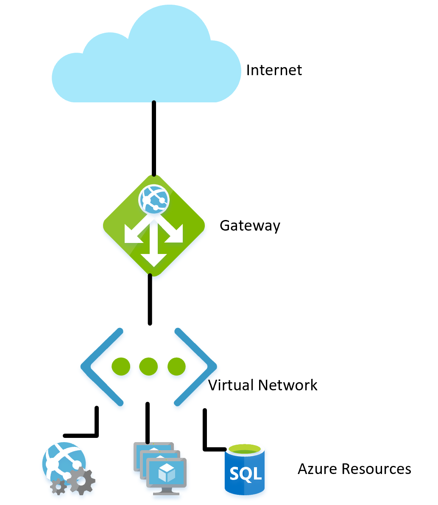
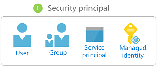
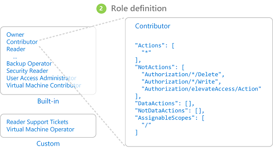
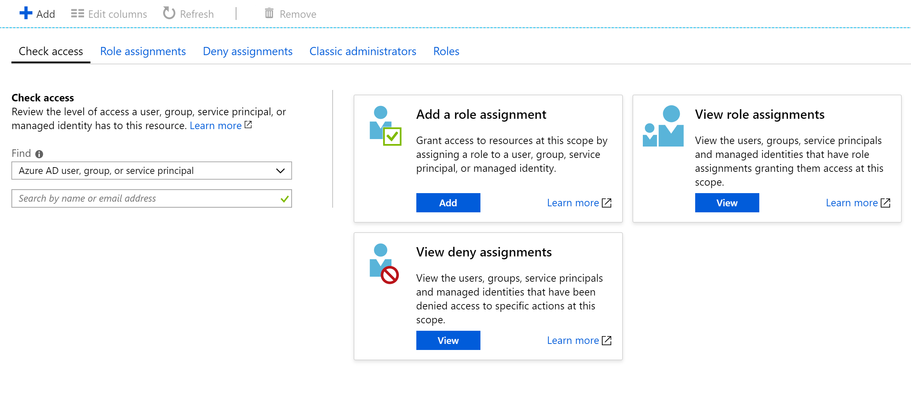
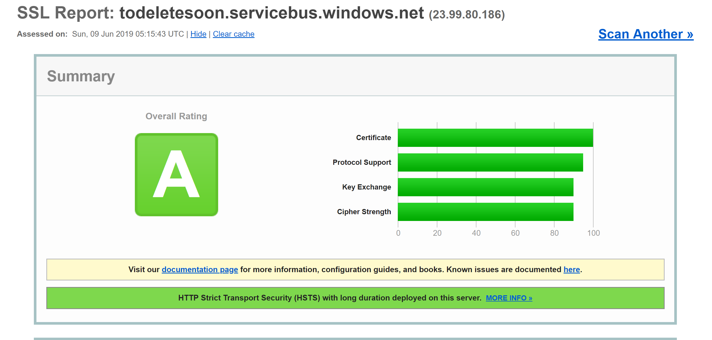
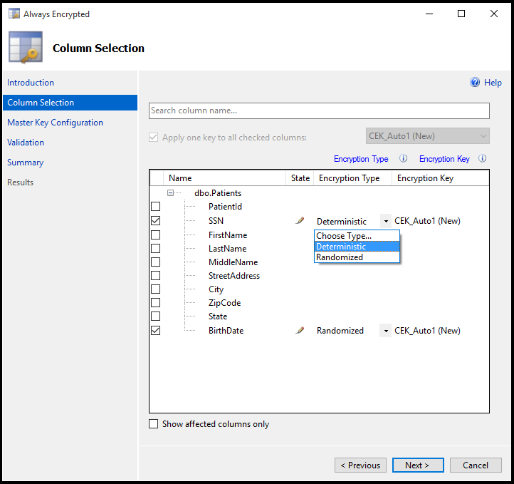
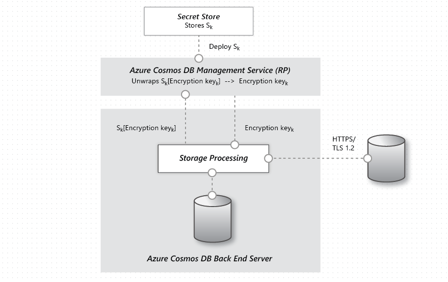

# Azure Security for Cloud Native Apps

Cloud Native Applications can be both easier and more difficult to secure than traditional applications. On the down side there are a lot more smaller applications which need to be secured so more energy must be dedicated to building out the security infrastructure. The heterogeneous nature of programming languages and styles in most service deployments also means that more attention needs to be paid to security bulletins from a range of providers. 

On the flip side smaller services, each with their own data store, limit the scope of an attack. Should an attacker compromise one system it may be more difficult for them to make the jump to another system than it would have been in a monolithic application. Process boundaries are pretty strong boundaries. Also if a database backup should leak then the damage should be more limited as that database contains only a subset of data and is unlikely to contain personally identifiable information if it does. 

No matter if the advantages outweigh the disadvantages of Cloud Native Applications the same sort of holistic security mindset must be followed. Security and secure thinking must be part of every step of the development and operations story. When planning an application ask questions like

* What would be the impact of this data being lost?
* How can we limit the damage from bad data being injected into this service?
* Who should have access to this data?
* Are there auditing policies in place around the development and release process?

holistic
web firewall
least exposer
principle of least privilege
https://azure.microsoft.com/support/trust-center/

# Azure Network Infrastructure

In an on-premise deployment environment a great deal of energy is dedicated to setting up networking. Setting up routers, switches and the such is complicated work. Networks allow certain resources to talk to other resources and prevent access in some cases. A frequent network rule is to restrict access to the production environment from the development environment on the off chance that a half-developed piece of code runs awry and deletes a swath of data. 

Out of the box most PaaS Azure resources have only the most basic, and most permissive networking set up. For instance anybody on the Internet can access an app service. New SQL server instances typically come restricted so that external parties cannot access them but the IP address ranges used by Azure itself are permitted through. So while the SQL server is protected from external threats an attacker need only set up an Azure bridgehead from which they can launch attacks against all SQL instances on Azure. 

Fortunately most Azure resources can be placed into an Azure Virtual Network which permits finer grained access control. In much the same way that on-premise networks establish private networks which are protected from the wider world Virtual Networks are islands of private IP addresses located within the Azure network. 



In the same way that on-premise networks would have a firewall governing access to the network a similar firewall can be established at the boundary of the Virtual Network. By default all the resources on a Virtual Network can still talk to the Internet, it is only incoming connections which require some form of load balancer. 

With the network established internal resources like storage accounts can be set up to only allow for access by resources which are also on the Virtual Network. This provides an extra level of security, should the keys for that storage account be leaked attackers would be unable to connect to it to exploit the leaked keys. This is another example of the principle of least privilege.

Continuing down the path of exemplifying the principle of least privilege not every resource within a Virtual Network needs to talk to every other resource. For instance in an application which provides a web API over a storage account and a SQL database it is unlikely that the database and the storage account need to be able to talk to one another. Any data sharing between them would go through the web application. Thus a [network security group(NSG)](https://docs.microsoft.com/en-us/azure/virtual-network/security-overview) could be used to deny traffic between the two services. 

A policy of denying communication between resources can be annoying to implement, especially coming from a background of using Azure without traffic restrictions. On some other clouds the concept of network security groups is much more prevalent. For instance on AWS the default policy is that resources cannot communicate amongst themselves until enabled by rules in a NSG. While slower to develop this more restrictive environment provides a more secure default. Making use of proper DevOps practices, especially using [ARM or Terraform](infrastructure-as-code.md) to manage permissions can make controlling the rules easier.

Virtual Networks can also be useful when setting up communication between resources which remain on-premise and those in the cloud. A virtual private network can be used to seamlessly attach the two networks together. This allows running a virtual Network without any sort of gateway for scenarios where all the users are on site. There are a number of technologies which can be used to establish this network. The simplest is to use a [site-to-site VPN](https://docs.microsoft.com/en-us/azure/vpn-gateway/vpn-gateway-about-vpngateways?toc=%2fazure%2fvirtual-network%2ftoc.json#s2smulti) which can be established between many routers and Azure. Traffic is encrypted and tunneled over the Internet at the same cost per byte as any other traffic. For scenarios where more bandwidth or more security is desirable Azure offers a service called [Express Route](https://docs.microsoft.com/en-us/azure/vpn-gateway/vpn-gateway-about-vpngateways?toc=%2fazure%2fvirtual-network%2ftoc.json#ExpressRoute) which uses a private circuit between an on-premise network and Azure. It is more costly and difficult to establish but also more secure. 

# Role Based Access Control for restricting access to Azure resources

Also known as RBAC, Role Based Access Control is a system that provides an identity to applications running in Azure. Applications can access resources using this identity instead of or in addition to using keys or passwords. 

## Security Principals

The first component in RBAC is a security principal. A security principal can be a user, group, service principal or managed identity. 



* User - Any user who has an account in Azure Active Directory is a user. 

* Group - A collection of users from Azure Active Directory. As a member of a group a user takes on the roles of that group in addition to their own.

* Service principal - A security identity under which service or applications run. 

* Managed identity - An Azure Active Directory identity managed by Azure. Managed identities are typically used when developing cloud applications which manage the credentials for authenticating to Azure services.

The security principal can be applied to most any resource. This means that it is possible to assign a security principal to a container running inside of Azure Kubernetes permitting it to access secrets stored in Key Vault. An Azure Function could take on a permission allowing it to talk to an Active Directory instance to validate a JWT for a calling user. Once services are enabled with a service principal their permissions can be managed granularly using roles and scopes.  

## Roles

A security principal can take on many roles or, using a more sartorial analogy, wear many hats. Each role defines a series of permissions such as "Read messages from Azure Service Bus endpoint". The effective permissions of a security principal is the combination of all the permissions assigned to all the roles that security principal has. Azure has a large number of built in roles and users can define their own roles. 



Built into Azure are also a number of high level roles Owner, Contributor, Reader and User Account Administrator. With the Owner role a security principal can access all resources and allocate permissions to others. A contributor has the same level of access to all resources but cannot allocate permissions. A Reader can only view existing Azure resources and a User Account Administrator is permitted to manage access to Azure resources. 

More granular built-in roles such as [DNS Zone Contributor](https://docs.microsoft.com/en-us/azure/role-based-access-control/built-in-roles#dns-zone-contributor) have rights limited to a single service. Security principals can take on any number of roles. 

## Scopes

Roles can be applied to a restricted set of resources inside of Azure. For instance applying scope to the previous example of reading from a Service Bus queue the permission can be narrowed to a single queue: "Read messages from Azure Service Bus endpoint `blah.servicebus.windows.net/queue1`"

The scope can be as narrow as a single resource or it can be applied to an entire resource group, subscription or even management group. 

When testing if a security principal has a certain permission the combination of role and scope are taken into account. This combination provides for very powerful authorization mechanism.

## Deny

Previously only "allow" rules were permitted for RBAC. This made some scopes quite complicated to build. For instance allowing a security principal access to all storage accounts except one required granting explicit permission to a potentially endless list of storage accounts. Any time a new storage account was created it would have to be added to this list of accounts. This added management overhead which certainly wasn't desirable. 

Deny rules take precedence over allow rules. Now representing the same "allow all but one" scope could be represented as two rules "allow all" and "deny this one specific one". Deny rules not only ease management but allow for resources which are extra secure by denying access to everybody.

## Checking Access

As you can imagine having a large number number of roles and scopes can make figuring out the effective permission of a service principal quite difficult. Piling deny rules on top of that only serves to increase the complexity. Fortunately, there is a permissions calculator which is able to show the effective permissions for any service principal. It is typically found under the IAM tab in the portal



# Securing Secrets

Passwords and certificates are a common attack vector for attackers. Password cracking hardware can brute force billions of passwords a second so it is important that the passwords used to access resources are strong, with a large variety of characters. These are exactly the sort of passwords which are near impossible to remember. Fortunately, the passwords in Azure don't actually need to be known by any human. 

Many security [experts suggest](https://www.troyhunt.com/password-managers-dont-have-to-be-perfect-they-just-have-to-be-better-than-not-having-one/) that using a password manager to keep your own passwords is the best approach. While it centralizes your passwords in one location it also allows using highly complex passwords and ensuring they are unique for each account. The same sort of system exists within Azure: a central store for secrets.

## Azure Key Vault

Azure Key Vault provides for a centralized location in which to store passwords for things like database as well as API keys and certificates. Once a secret is entered into the Vault it is never shown again and the commands to extract and view it are purposefully complicated. The information in the safe is protected using either software encryption or FIPS 140-2 Level 2 validates Hardware Security Modules. 

Access to the key vault is provided through Role Base Access Controls meaning that not just any user can access the information in the vault. Say a web application wishes to access the database connection string stored in Azure Key Vault. To gain access applications need to run using a service principal. Under this assumed role they can read the secrets from the safe. There are a number of different security settings which can further limit the access an application has to the vault so that it cannot update secrets only read them. 

Access to the key vault can be monitored to ensure that only the expected applications are accessing the vault. The logs can be integrated back into Azure Monitor unlocking the ability to set up alerts when unexpected conditions are encountered. 

## Kubernetes

Within Kubernetes there is a similar service for maintaining small pieces of secret information. Kubernetes Secrets can be set via the typical kubectl executable. 

To create a secret it is as simple as finding the base64 version of the values to be stored.  

```
echo -n 'admin' | base64
YWRtaW4=
echo -n '1f2d1e2e67df' | base64
MWYyZDFlMmU2N2Rm
```

Then adding it to a secrets file called something like `secret.yml` which looks like 

```
apiVersion: v1
kind: Secret
metadata:
  name: mysecret
type: Opaque
data:
  username: YWRtaW4=
  password: MWYyZDFlMmU2N2Rm
```

Finally this can be loaded into Kubernetes by running 

```
kubectl apply -f ./secret.yaml
```

These secrets can then be mounted into volumes or exposed to container processes through environmental variables. The [12 factor app](https://12factor.net/) approach to building applications suggests using the lowest common denominator to transmit settings to an application. This is environmental variables as they are supported no matter the operating system or application.   

As an alternative to using the built in Kubernetes secrets it is possible to access the secrets in Azure Key Vault from within Kubernetes. The simplest way to do this is to assign an RBAC role to the container looking to load secrets. The application can then use the Azure Key Vault APIs to access the secrets. Of course this approach requires modifications to code and doesn't follow the pattern of using environmental variables. Instead it is possible to inject values into a container through use of the [Azure Key Vault Injector](https://mrdevops.io/introducing-azure-key-vault-to-kubernetes-931f82364354). This approach is actually more secure than using the Kubernetes secrets directly as they can be accessed by users on the cluster.


# Encryption in transit and at rest

Keeping data safe is important both when it is on disk and when it is transiting between various different services. The most effective way to keep data from leaking is to encrypt it into a format that can't be easily read by others. Azure supports a wide range of encryption options. 

## In transit

To encrypt traffic on the network in Azure several approaches are possible. For Azure services access to them is typically done over connections which make use of Transport Layer Security(TLS). For instance all the connections to the Azure APIs requires TLS connections. Equally connections to endpoints in Azure storage can be restricted to work only over TLS encrypted connections.

TLS is a pretty complicated protocol and simply knowing that the connection is using TLS isn't sufficient to ensure security. For instance TLS 1.0 is chronically insecure and TLS 1.1 is not much better. Even within the versions of TLS there are various settings which can make the connections easier to decrypt. The best course of action is to check and see if the server connection is using up to date and well configured protocols. 

This check can be done by an external service such as SSL labs' SSL Server Test. A test run against a typical Azure endpoint, in this case a service bus endpoint, yields a near perfect score of A.

Even services like Azure SQL databases make use of TLS encryption to keep data hidden. The interesting part about encrypting the data in transit using TLS is that is is not possible for even Microsoft to listen in on the connection between computers running TLS. This should provide comfort for companies concerned that their data may be at risk from Microsoft proper or even a state actor with more resources than the standard attacker. 



While this level of encryption is not going to be sufficient for all time it should inspire confidence that Azure TLS connections are, in fact, quite secure. Azure will continue to evolve its security standards as encryption improves. It is nice to know that there is somebody watching the security standards and updating Azure as they improve. 

## At Rest

In any application there are a number of places where data rests on disk. The application code itself is loaded from some storage mechanism. Most applications also make use of a database of some sort be it SQL Server or CosmosDB or even the amazingly price efficient Table Storage. These databases all make use of heavily encrypted storage to ensure that nobody other than the applications with proper permissions can read your data. Even the system operators cannot read data which has been encrypted so customers can remain confident that their secret information remains such. 

### Storage

The underpinning of much of Azure is the Azure storage engine. Virtual machine disks are mounted on top of Azure Storage. Azure Kubernetes Services runs on virtual machines which, themselves, are hosted on Azure Storage. Even serverless technologies like Azure Functions Apps and Azure Container Instances run out of disk which is part of Azure Storage.

If Azure Storage is well encrypted then it provides for a foundation for most everything else to also be encrypted. Azure Storage [is encrypted](https://docs.microsoft.com/en-us/azure/storage/common/storage-service-encryption) with [FIPS 140-2](https://en.wikipedia.org/wiki/FIPS_140) compliant [256 bit AES](https://en.wikipedia.org/wiki/Advanced_Encryption_Standard). This is a well regarded encryption technology having been the subject of extensive academic scrutiny over the last 20 or so years. At present, there is no known practical attack that would allow someone without knowledge of the key to read data encrypted by AES.   

The keys used for encrypting Azure Storage are, by default, managed by Microsoft. There are extensive protections in place to ensure that Microsoft employees are unable to access and use these keys nefariously. However, users with particular encryption requirements can also [provide their own storage keys](https://docs.microsoft.com/en-us/azure/storage/common/storage-encryption-keys-powershell) which are managed in Azure Key Vault. These keys can be revoked at any time which would effectively render the contents of the Storage account using them inaccessible. 

Virtual machines use encrypted storage but it is possible to provide another layer of encryption by using technologies like BitLocker on Windows or DM-Crypt on Linux. These technologies mean that even if the disk image were to be leaked off of storage it would remain near impossible to read. 

### Azure SQL

Databases hosted on Azure SQL make use of a technology called [Transparent Data Encryption(TDE)](https://docs.microsoft.com/sql/relational-databases/security/encryption/transparent-data-encryption) to ensure that data remains encrypted. It is enabled by default on all newly created SQL databases but must be enabled manually for legacy databases. TDE performs real-time encryption and decryption of not just the database but also the backups and transaction logs. 

The encryption parameters are stored in the `master` database and, on start up, is read into memory for the remaining operations. This does mean that the `master` database must remain unencrypted. The actual key is managed by Microsoft. However users with exacting security requirements may provide their own key in Key Vault in much the same way as is done for Azure Storage. The Key Vault provides for such services as key rotation and revocation. 

The "Transparent" part of TDS comes from the fact that there are no client changes needed to make use of an encrypted database. While this approach provides for good security leaking the database password is enough for users to be able to decrypt the data. There is another approach which encrypts individual columns or tables in a database. [Always Encrypted](https://docs.microsoft.com/en-us/azure/sql-database/sql-database-always-encrypted-azure-key-vault) ensures that at no point is the encrypted data never appears in plain text inside the database. 

Setting up this tier of encryption requires running through a wizard in SQL Server Management Studio to select the sort of encryption and where in KeyVault to store the associated keys. 



Client applications which read information from these encrypted columns do need to make special allowances to read encrypted data. Connection strings need to be updated with `Column Encryption Setting=Enabled` and client credentials must be retrieved from the Key Vault. The SQL Server client must then be primed with the column encryption keys. Once that is done the remaining actions use the standard interfaces to SQL Client meaning that tools like Dapper and Entity Framework which are built on top of SQL Client will continue to work without changes. Always Encrypted may not yet be available for every SQL Server driver on every language.

The combination of TDE and Always Encrypted both of which can be used with client specific keys ensures that even the most exacting encryption requirements are catered for. 

### Cosmos DB

Cosmos DB is the newest, and coolest, database provided by Microsoft in Azure. It has been built from the ground up with security and cryptography in mind. AES-256bit encryption is standard for all Cosmos DB databases and cannot, in fact, be disabled. Coupled with the TLS 1.2 required to communicate over HTTP with Cosmos DB the entire storage solution is encrypted.



While Cosmos DB does not provide for supplying customer encryption keys there has been significant work done by the team to ensure that it remains PCI-DSS compliant without that. Cosmos also does not yet support any sort of single column encryption similar to Azure SQL's Always Encrypted.


# Keeping Secure

Azure has all the tools necessary to release a highly secure product. However a ladder is only as strong as its weakest rung. If the applications deployed on top of Azure are not developed with a proper security mindset and good security audits then they will become the weak rung, the weak link in the chain, the unlocked door. There are many great [static analysis tools](https://www.whitesourcesoftware.com/), [encryption libraries](https://www.libressl.org/) and [security practices](https://azure.microsoft.com/en-ca/resources/videos/red-vs-blue-internal-security-penetration-testing-of-microsoft-azure/) that can be used to ensure that the software installed on Azure is as secure as Azure itself.  

>[!div class="step-by-step"]
>[Previous](security.md)
>[Next](cloud-native-devops.md)
