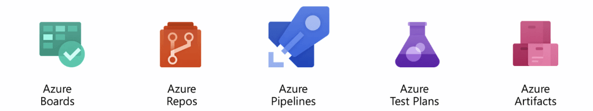
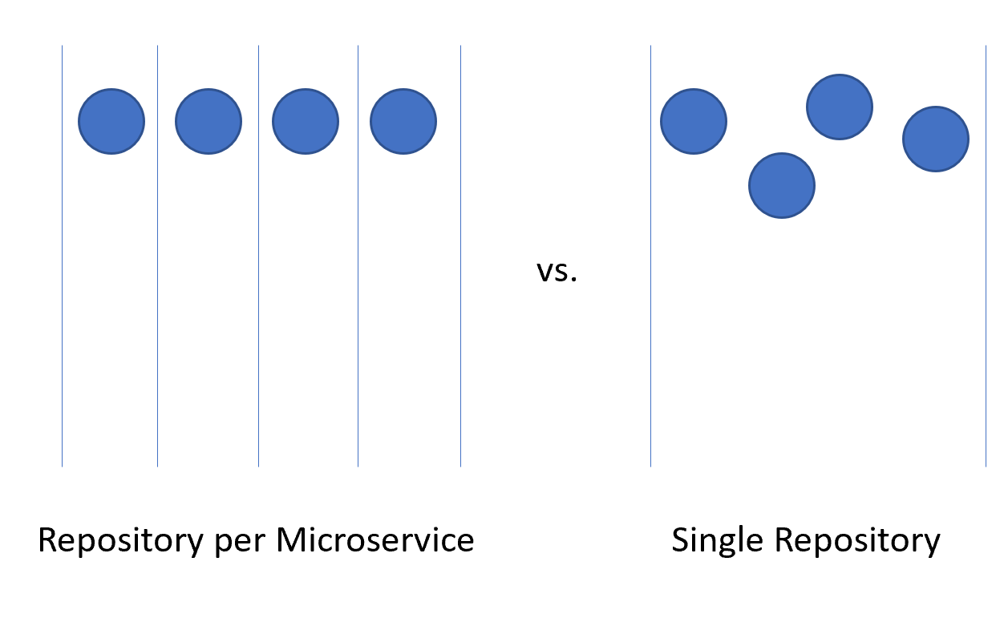
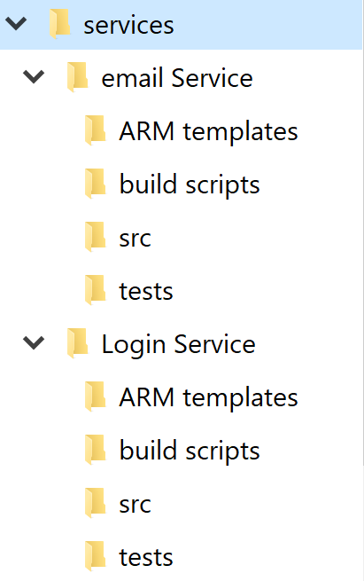
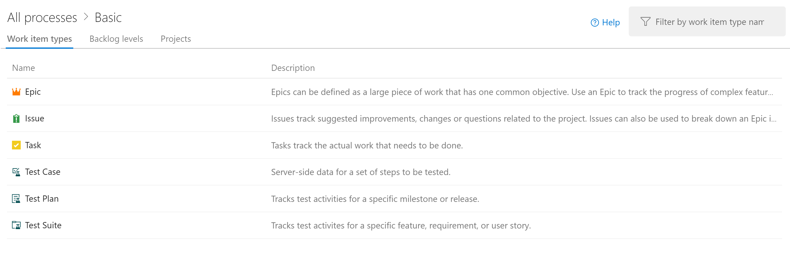
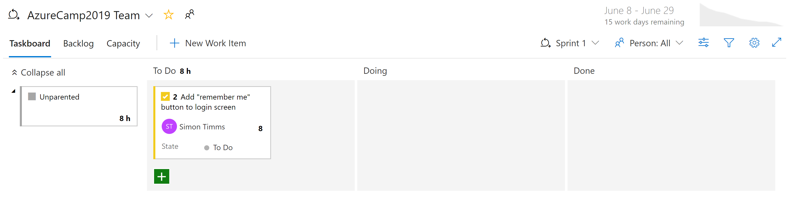
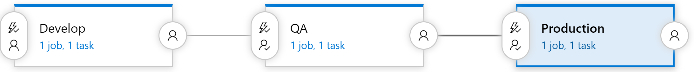

# Cloud Native DevOps

The favorite mantra of software consultants is to answer "It depends" to any question posed. It isn't because software consultants are fond of not taking a position it is because there is no one true answer to any questions in software. No absolute right and wrong but rather a balance between opposites. 

Take, for instance, the two major schools of developing web applications: Single Page Applications (SPAs) vs. Server Side Applications. On one hand the user experience tends to be better with SPAs and the amount of traffic to the web server can be minimized making it possible to host them on something as simple as static hosting. On the other hand SPAs tend to be slower to develop and more difficult to test. Which one is the right choice? Well it depends on your situation. 

Cloud Native Applications are not immune to that same dichotomy. They have clear advantages in terms of speed of development, stability and scalability but managing them can be quite a bit more difficult. 

Years ago it was not uncommon for the process of moving an application from development to production to take a month, or even more. Companies released software on a 6-month or even every year cadence. One need look no further than Microsoft Windows to get an idea for the cadence of releases which were acceptable before the ever-green days of Windows 10. 5 years passed between Windows XP and Vista, a further 3 between Vista and Windows 7.

It is now fairly well established that being able to release software rapidly give fast-moving companies a huge market advantage over their more sloth-like competitors. It is for that reason that major updates to Windows 10 are now approximately every 6 months. 

The patterns and practices which enable faster, more reliable releases to deliver value to the business are collectively known as DevOps. They consist of a wide range of ideas spanning the entire software development lifecycle from specifying an application all the way up to delivering and operating that application. 

DevOps emerged before Microservices and it is likely that the movement towards smaller, more fit to purpose services would have not been possible without DevOps to facilitate releasing and operating not just one but many applications in production. 


Through good DevOps practices it is possible to realize the advantages of Cloud Native Applications without suffocating under a mountain of work actually operating the applications. 

There is no golden hammer when it comes to DevOps, nobody can sell a complete and all encompassing solution to releasing and operating high quality applications. This is because each application is wildly different from all others. However, there are tools which can make DevOps a far less daunting proposition. One of these is known as Azure DevOps. 

# Azure DevOps

Azure DevOps has a long pedigree. It can trace its roots back to when Team Foundation Server first move online and through the various name changes: Visual Studio Online and Visual Studio Team Services. Through the years, however, it has become far more than its predecessors. 

Azure DevOps is divided into five major components: Boards, Repos, Pipelines, Test Plans and Artifacts. 



**Azure Boards** - Provides an issue and work item tracking tool which strives to allow users to pick the workflows which work best for them. It comes with a number of pre-configured templates including ones to support SCRUM and Kanban styles of development. 

**Azure Repos** - Source code management which supports the venerable Team Foundation Version Control (TFVC) as well as the industry favorite git. Pull requests provide a way to enable social coding by fostring discussion of changes as they are made. 

**Azure Pipelines** - A build and relese management system which supports tight integration with Azure. Builds can be run on a variety of platforms from Windows to Linux to MacOS. Build agents may be provisioned in the cloud or on premise. 

**Azure Test Plans** - No QA person will be left behind with the test management and exploratory testing support offered by the Test Plans Features.

**Azure Artifacts** - An artifact feed which allows companies to create their own, internal, versions of nuget, npm and others. It serves a double purpose of acting as a cache of upstream packages in the event of failure of a centralized repository.

The top-level container in Azure DevOps is known as a Project. The components can be turned on and off for any project. If users want to manage their source code in GitHub but still take advantage of Azure Pipelines then that's perfectly possible. In fact, many open source projects have taken advantages of the [free builds](https://azure.microsoft.com/en-ca/blog/announcing-azure-pipelines-with-unlimited-ci-cd-minutes-for-open-source/) offered by Azure DevOps while keeping their source code on GitHub. Some significant open source project such as [Visual Studio Code](https://code.visualstudio.com/), [yarn](https://yarnpkg.com/en/), [gulp](https://gulpjs.com/) and [NumPy](https://www.numpy.org/) have made the transition. 

Each of these components provides some advantages for Cloud Native Applications but the three most useful are the source control, boards and pipelines.  

## Source Control

Organize the code for a Cloud Native Application can be somewhat challenging. Instead of a single giant application the Cloud Native Applications tend to be made up of a web of smaller applications which talk with one another. As with all things in computing the best arrangement of code remains an open question. There are examples of successful applications using a variety of layouts but two variants seem to have the most popularity. 

Before getting down into the actual source control itself it is probably worth deciding on how many projects are appropriate. Within a single project is support for multiple repositories, and build pipelines. Board are a little more complicated but there too the tasks can easily be assigned to multiple teams within a single project. It is certainly possible to support hundreds, even thousands of developers out of a single Azure DevOps project. Doing so is likely the best approach as it provides a single place for all developer to work out of and reduces the confusion of finding that one application when developers are unsure of even which project in which it resides. 

With the single project argument settled the question moves to how to split up the code for the microservices. 



### Repository per Microservice

At first glance this seems like the most logical approach to splitting up the source code for microservices. Each repository can contain the code needed to build the one microservice. The advantages to this approach are readily visible: 

1. Instructions for building and maintaining the application can be added to a README file at the root of each repository. When flipping through the repositories it will be easy to find these instruction reducing spin up time for developers. 
2. Every service is located in a logical place, easily found by knowing the name of the service. 
3. Builds can easily be set up such that they're only triggered when a change is made to the owning repository.
4. The number of changes coming into a repository is limited to the small number of developers working on the project. 
5. Security is easy to set up by restricting the repositories to which developers have read and write permissions.
6. Repository level settings can be changed by the owning team with a minimum of discussion with others

One of the key ideas behind microservices is that services should be siloed and separated from each other. This idea is reflected by the isolation of microservice data to a database separate and autonomous from the rest of the services. It makes a great deal of sense to carry this idea all the way through to the source code.

However, this approach is not without its issues. One of the more gnarly development problems of our time is managing dependencies. Consider the number of files which make up the average `node_modules` directory. A fresh install of something like `create-react-app` is likely to bring with it thousands of packages. The question of how to manage these dependencies is a difficult one. 

If a dependency is updated then downstream packages must also update this dependency. Unfortunately, that takes development work so, invariably, the `node_modules` directory ends up with multiple versions of a single package, each one a dependency of some other package which is versioned at a slightly different cadence. When deploying an application which version of a dependency should be used? The version which is currently in production? The version which is currently in Beta but is likely to be in production by the time the consumer makes it to production? Difficult problems which are not resolved by simply using microservices. 

There are libraries which are depended upon by a wide variety of projects. By dividing the microservices up with one in each repository the internal dependencies can best be resolved by using the internal repository, Azure Artifacts. Builds for libraries will push their latest versions up into Azure Artifacts for internal consumption. Downstream project must still be manually updated to take a dependency on the newly updated packages. 

Another disadvantage presents itself when moving code between services. Although it would be nice to believe that the first division of an application into microservices is 100% correct the reality is that rarely are we so prescient as to make no service division mistakes. Thus functionality and the code which drives it will need to move from service to service: repository to repository. When leaping from one repository to another the code loses its history. There are many cases, especially in the even of an audit, where having full history on a piece of code is invaluable. 

The final, and perhaps most important disadvantage is coordinating changes. In a true microservices application there should be no deployment dependencies between services. It should be possible to deploy services A, B and C in any order as they have loose coupling. In reality, however, there are times when it is desirable to make a change which crosses multiple repositories at the same time. Some examples include updating a library to close a security hole or changing a communication protocol used by all services. 

To perform a cross-repository change requires a commit to each repository be made in succession. Each change in each repository will need to be pull-requested and reviewed separately. This can be difficult to coordinate and generally annoying to perform.

An alternative to using many repositories is to put all the source code together in a giant, all knowing, single repository.

### Single Repository

In this approach, sometimes referred to as a [monorepository](http://danluu.com/monorepo/) all the source code for every service is put into the same, single repository. At first this seems like a terrible idea likely to make dealing with source code unwieldy. There are, however, some marked advantages to working in this way. 

The first is that it is easier to manage dependencies between projects. Instead of relying on some external artifact feed projects can directly import one another. This means that updates are instant and conflicting versions are likely to be found at compile time on the developer's workstation. In effect shifting some of the integration testing left. 

When moving code between projects it is now easier to preserve the history as the files will be detected as having been moved rather than being rewritten. 

Another advantage is that wide ranging changes that cross service boundaries can be made in a single commit. This reduces the overhead of having potentially dozens of changes to review individually. 

There are numerous tools which can perform static analysis of code in order to detect insecure programming practices or problematic use of APIs. In a multi-repository world each repository will need to be iterated over to find the problems in them. The single repository allows running the analysis all in one place. 

There are numerous disadvantages to the single repository approach also. One of the more worrying ones is that having a single repository raises security concerns. If the contents a single repository are leaked in a repository per service model the amount of code lost is minimal. With a single repository everything the company owns could be lost. There have been many examples in the past of this happening and derailing entire game development efforts. Having multiple repositories exposes less surface area which is a very desirable trait in most security practices. 

The size of the single repository is likely to become unmanageable rapidly. This presents some interesting performance implications. It may become necessary to use specialized tools such as [Virtual File System for Git](https://vfsforgit.org/) which was originally designed to improve the experience for developers on the Windows team. 

Frequently the argument for using a single repository boils down to an argument that Facebook or Google make use of this method of source code arrangement. If the approach is good enough for these companies then, surely, it is the correct appraoch for all companies. The truth of the matter is that very few companies operate on anything like the scale of Facebook or Google. The problems which occur at those scales are different from those most developers will face. What is good for the goose may not be good for the gander. 

In the end either solution can be used to house the source code for microservices. However, in most cases, the management and engineering overhead of operating in a single repository is not worth the meager advantages. Splitting code up over multiple repositories encourages better separation of concerns and encourages autonomy among development teams.  

### Standard Directory Structure

Regardless of the single vs. multiple repository debate each service will have its own directory. One of the best optimizations to allow developers to cross between projects quickly is to maintain a standard directory structure. 



Whenever a new project is created a template which puts in place the correct structure should be used. This template can also include such useful items as a skeleton README file and an `azure-pipelines.yml`.  In any microservice architecture a high degree of variance between projects makes bulk operations against the services more difficult. 

There are many tools which can provide templating for an entire directory, containing several source code directories. [Yeoman](https://yeoman.io/) is popular in the JavaScript world and GitHub have recently released [Repository Templates](https://github.blog/2019-06-06-generate-new-repositories-with-repository-templates/) which provide much of the same functionality. 

## Task Management

Managing tasks in any project can be difficult. Up front there are countless questions to be answered about the sort of workflows to set up for to ensure optimal developer productivity. 

Cloud Native Applications tend to be smaller than traditional software product or at least they are divided into smaller services. Tracking of issue or task related to these services remains as important as with any other software project. Nobody wants to loose track of some work item or explain to a customer that their issue wasn't properly logged. Boards are configured at the project level but within each project areas can be defined. These allow breaking down issues across several components. The advantage to keeping all the work for the entire application in one place is that it is easy to move work items from one team to another as they are understood better. 

Azure DevOps comes with a number of popular templates pre-configured. In the most basic configuration all that is needed it to know what is in the backlog, what people are working on and what's done. It is important to have this visibility into the process of building software so that work can be prioritized and completed tasks reported to the customer. Of course, very few software projects stick to a process as simple as `to do`, `doing` and `done`. It doesn't take long for people to start adding steps like `QA` or `Detailed Specification` to the process. 

One of the more important parts of Agile methodologies is self-introspection at regular intervals. These reviews are meant to provide insight into what problems the team is facing and how they can be improved. Frequently, this means changing the flow of issues and features through the development process. So it is perfectly health to expand the layouts of the boards with additional stages.

The stages in the boards are not the only organizational tool. Depending on the configuration of the board there is a hierarchy of work items. The most granular item which can appear on a board is a task. Out of the box a task contains fields for a title, description, a priority, an estimate of the amount of work remaining and the ability to link to other work items or development items (branches, commits, pull requests, builds and so forth). Work items can be classified into different areas of the application and different iterations (sprints) to make finding them easier.


The description field supports the normal styles you'd expect (bold, italic underscore and strike through) and also the ability to insert images. This makes it a very powerful tool for use when specifying work or bugs.

Tasks can be rolled up into features, which define a larger unit of work. Features, in turn, can be [rolled up into epics](https://docs.microsoft.com/en-us/azure/devops/boards/backlogs/define-features-epics?view=azure-devops). Classifying tasks in this hierarchy makes it much easier to understand how close a large feature is to rolling out.



There is a variety of different views into the the issues in Boards. Items which are not yet scheduled appear in the backlog. From there they an be assigned to a sprint. A sprint is a time box during which it is expected some quanity of work will be completed. This work can include tasks but also the resolution of tickets. Once there the entire sprint can be managed from the Sprint board section. This view shows how work is progressing and includes a burndown chart to give an ever updating estimate of if the sprint will be successful.



By now it should be apparent that there is a great deal of power in the Boards in Azure DevOps. For developers there are easy views of what is being worked on. For project managers views into upcoming work as well as an overview of existing work. For managers there are plenty of reports about resourcing and capacity. Unfortunately, there is nothing magical about Cloud Native Applications which eliminate the need to track work. But if you have to track work there are few places where the experience is better than in Azure DevOps.

## CI/CD Pipelines

Almost no change in the software development lifecycle has been so revolutionary as the advent of continuous integration and continuous delivery. Building and running automated tests against the source code of a project as soon as a change is checked in catches mistakes early. Prior to the advent of continuous integration builds it would not be uncommon to pull code from the repository and find that it did not pass tests or couldn't even be built. This resulted in a lot of tracking down the source of the breakage. 

Traditionally shipping software to the production environment required extensive documentation and a list of steps. Each one of these steps needs to be manually completed in a very error prone process. 


The sister of continuous integration is continuous delivery in which the freshly built packages are deployed to an environment. The manual process cannot scale to match the speed of development so automation becomes more important. Checklists are replaced by scripts which can perform the same tasks faster and more accurately than any human. 

The environment to which continuous delivery delivers might be a test environment or, as is being done by many major technology companies, it could be the production environment. The latter requires an investment in high quality tests which can give confidence that a change is not going to break production for users. In the same way that continuous integration caught issues in the code early continuous delivery catches issues in the deployment process early. 

The importance of automating the build and delivery process is accentuated by Cloud Native Applications. Deployments happen more frequently and to more environments so manually deploying boarders on impossible. 

### Azure Builds

Azure DevOps provides a set of tools to make continuous integration and deployment easier than ever. These tools are located under Azure Pipelines. The first of them is Azure Builds. This is a tool for running YAML based build definitions at scale. Users can either bring their own build machines (great for if the build requires a meticulously set up environment) or use a machine from a constantly refreshed pool of Azure hosted virtual machines.  These hosted build agents come pre-installed with a wide range of development tools for not just .NET development but for everything from Java to Python to iPhone development. 

DevOps includes a wide range of out of the box build definitions which can be customized for any build. The build definitions are defined in a file called `azure-pipelines.yml` and checked into the repository so they can be versioned along with the source code. This makes it much easier to make changes to the build pipeline in a branch as the changes can be check into just that branch. An example `azure-pipelines.yml` for building an ASP.NET web application on full framework looks like

```
name: $(rev:r)

variables:
  version: 9.2.0.$(Build.BuildNumber)
  solution: Portals.sln
  artifactName: drop
  buildPlatform: any cpu
  buildConfiguration: release
  
pool:
  name: Hosted VS2017
  demands:
  - msbuild
  - visualstudio
  - vstest

steps:
- task: NuGetToolInstaller@0
  displayName: 'Use NuGet 4.4.1'
  inputs:
    versionSpec: 4.4.1

- task: NuGetCommand@2
  displayName: 'NuGet restore'
  inputs:
    restoreSolution: '$(solution)'
    
- task: VSBuild@1
  displayName: 'Build solution'
  inputs:
    solution: '$(solution)'
    msbuildArgs: '/p:DeployOnBuild=true /p:WebPublishMethod=Package /p:PackageAsSingleFile=true /p:SkipInvalidConfigurations=true /p:PackageLocation="$(build.artifactstagingdirectory)\\"'
    platform: '$(buildPlatform)'
    configuration: '$(buildConfiguration)'

- task: VSTest@2
  displayName: 'Test Assemblies'
  inputs:
    testAssemblyVer2: |
     **\$(buildConfiguration)\**\*test*.dll
     !**\obj\**
     !**\*testadapter.dll
    platform: '$(buildPlatform)'
    configuration: '$(buildConfiguration)'

- task: CopyFiles@2
  displayName: 'Copy UI Test Files to: $(build.artifactstagingdirectory)'
  inputs:
    SourceFolder: UITests
    TargetFolder: '$(build.artifactstagingdirectory)/uitests'

- task: PublishBuildArtifacts@1
  displayName: 'Publish Artifact'
  inputs:
    PathtoPublish: '$(build.artifactstagingdirectory)'
    ArtifactName: '$(artifactName)'
  condition: succeededOrFailed()
```

This build definition uses a number of built in tasks which make creating builds as simple as building a Lego set (simpler than the giant Millennium Falcon). For instance the NuGet task restores NuGet packages while the VSBuild task calls out to the Visual Studio build tools to perform the actual compilation. There are hundreds of different tasks available in Azure DevOps with thousands more which are community maintained. It is likely that no matter what build tasks you're looking to run somebody has built one already.

Builds can be trigged manually, by a checkin, on a schedule or by the completion of another build. In most cases building on every checkin is desirable. Builds can be filtered so that different builds run against different parts of the repository or against different branches. This allows for scenarios like running fast builds with reduced testing on pull requests and running a full regression suite against the trunk on a nightly basis. 

The end result of a build is a collection of files known as build artifacts. These can be passed along to the next step in the build process or added to an Azure Artifact feed so they can be consumed by other builds. 

### Azure DevOps Releases

Builds take care of compiling the software into a shippable package but the artifacts still need to be pushed out to a testing environment to complete continuous delivery. For this Azure DevOps uses a separate tool called Releases. Releases make use of the same library of tasks which were available to the Build but introduce a concept of "stages". A stage is an isolated environment into which the package is installed. For instance a product might make use of a develop, a QA and a production environment. Code is continuously delivered into the development environment where automated tests can be run against it. Once those tests pass the release moves onto the QA environment for manual testing. Finally the code is pushed to production where it is visible to everybody. 



Each stage in the build can be automatically trigged by the completion of the previous phase. In many cases, however, this isn't desirable. Moving code into production might require approval from somebody. Releases supports this by allowing approvers at each step of the release pipeline. Rules can be set up such that a specific person or group of people must sign off on a release before it makes it to production. These gates allow for manual quality checks and also for compliance with any regulatory requirements pertaining to controls on what goes into production. 

### Everybody Gets a Build Pipeline

There is no cost to configuring many build pipelines so it is advantageous to have at least one build pipeline per microservice. Ideally microservices are independently deployable to any environment so having each one able to be released via its own pipeline without releasing a mass of unrelated code is perfect. Each pipeline can have its own set of approvals allowing for variations in build process for each service. 

### Versioning Releases

One drawback to using the Releses functionality is that it cannot be defined in a checked in `azure-pipelines.yml` file. There are many reason you might want to do that from having per-branch release definitions to including a release skeleton in your project template. Fortunately work is ongoing to shift some of the stages support into the Build component. This will be known as multi-stage build and the first version are available right now!

# Infrastructure As Code

Cloud Native Applications tend to make use of all sorts of fantastic Platform as a Service component. On a cloud platform like Azure these components might include things like storage, Service Bus and the SignalR service. As applications become more complicated the number of these services in use is likely to grow. Just as how continuous delivery broke the traditional model of deploying to an environment manually the rapid pace of change also broke the model of having a centralized IT group manage environments. 

Building environments can, and should, also be automated. There is a wide range of very well thought out tools which can make the process easy. 

## Azure Resource Manager Templates

Also known as ARM Template, Azure Resource Manager Templates are a JSON-based language for defining various resources in Azure. The basic schema looks something like this:

```
{
  "$schema": "https://schema.management.azure.com/schemas/2015-01-01/deploymentTemplate.json#",
  "contentVersion": "",
  "apiProfile": "",
  "parameters": {  },
  "variables": {  },
  "functions": [  ],
  "resources": [  ],
  "outputs": {  }
}
```

Within this template one might a storage container inside the resources section like so

```
"resources": [
    {
      "type": "Microsoft.Storage/storageAccounts",
      "name": "[variables('storageAccountName')]",
      "location": "[parameters('location')]",
      "apiVersion": "2018-07-01",
      "sku": {
        "name": "[parameters('storageAccountType')]"
      },
      "kind": "StorageV2",
      "properties": {}
    }
  ],
```

The templates can be parameterized so that one template can be reused with different settings to define develop, QA and production environments. This help eliminate surprises when migrating to a higher environment that is set up differently from the lower environments. The resources defined in a template are typically all created within a single resource group on Azure (it is possible to define multiple resource groups in a single ARM template but unusual). This makes it very easy to delete an environment by simply deleting the resource group as a whole. Cost analysis can also be run at the resource group level allowing for quick accounting of which environments are costing what.

There are many example templates defined in the [Azure Quickstart Templates](https://github.com/Azure/azure-quickstart-templates) project on GitHub which will give a leg up when starting on a new template or adding to an existing one. 

ARM templates can be run in a variety of ways. Perhaps the simplest way is to simply paste them into the Azure Portal. For experimental deployments this can be very quick. They can also be run as part of build or release process in Azure DevOps. There are tasks which will leverage connections into Azure to run the templates. Changes to ARM templates are applied incrementally meaning that to add a new resource requires just adding it to the template. The tooling will handle diffing the current resource group with the desired resource group defined in the template. Resources will then be created or altered so they match what is defined in the template.  

## Terraform

A perceived disadvantage of ARM templates is that they are specific to the Azure cloud. It is quite unusual to create applications which include resources from more than one cloud but in cases where the business relies on spectacular uptime the cost of supporting multiple clouds might be worthwhile. If there were one templating language which could be used across every cloud then it would also allow for developer skills to be much more portable. 

Several technologies exist which do just that! The most mature offering in that space is known as [Terraform](https://www.terraform.io/). It supports every major cloud player from Azure to GCP to AWS to AliCloud as well as literally dozens of minor players such as Heroku and DigitalOcean. Instead of using JSON as the template definition language it makes use of the slightly more terse YAML. 

An example Terraform file which performs the same looks lke 

```
provider "azurerm" {
  version = "=1.28.0"
}

resource "azurerm_resource_group" "test" {
  name     = "production"
  location = "West US"
}

resource "azurerm_storage_account" "testsa" {
  name                     = "${var.storageAccountName}"
  resource_group_name      = "${azurerm_resource_group.testrg.name}"
  location                 = "${var.region}"
  account_tier             = "${var.tier}"
  account_replication_type = "${var.replicationType}"

}
```

Terraform does a better job of providing sensible error messages when a resource cannot be deployed due to an error in the template. This is an area where ARM templates have some ongoing challenges. There is also a very handy validate task which can be used in the build phase to catch template errors early. 

Just as with ARM templates there are command line tools which can be used to deploy Terraform templates. Of course, there are also community created tasks in Azure pipelines which can validate and apply Terraform template. 

In the event that the Terraform or ARM template output interesting values such as the connection string to a newly created database they can be captured in the build pipeline and used in subsequent tasks. 

# Cloud Native Application Bundles

A key property of Cloud Native Applications is that they leverage the properties of the cloud to speed up development. This often means that an full application users a variety of different technologies. Applications may be shipped in Docker containers, some services may use Azure Functions while other parts may run directly on virtual machines allocated on big metal servers with hardware GPU acceleration. No two Cloud Native Applications are the same so it has been difficult to provide a single mechanism for shipping them. 

The Docker containers may run on Kubernetes using a Helm Chart for deployment. The Azure Functions may be allocated using Terraform templates. Finally the virtual machines may be allocated using Terraform but built out using Ansible. This is a whole mess of technologies and there has been no way to package them all together into a reasonable package. Until now. 

Cloud Native Application Bundles are a joint effort of a number of community minded companies such as Microsoft, Docker and HashiCorp to develop a specification to package distributed applications. 

The effort was announced in December of 2018 so there remains a fair bit of work to do to expose the effort the the greater community. Already, however, there is an [open specification](https://github.com/deislabs/cnab-spec) as well as a reference implementation known as [Duffle](https://duffle.sh/). This tool, written in go, is a joint effort between Docker and Microsoft. 

The CNABs can contain a variety of different installation technologies. This allows things like Helm Charts, Terraform templates, and Ansible Playbooks to coexist in the same package. Once built the packages are self-contained and portable; they can be installed form a USB stick.  The packages are cryptographically signed to ensure that they originate from the party they claim.

The core of a CNAB is a file called `bundle.json`. This file defines the contents of the bundle, be they Terraform or images or anything else. This example defines a CNAB which invokes some Terraform. Notice, however that it actually defines an invocation image which is used to invoke the Terraform. When packaged up the Docker file located in the cnab directory will be built into a docker image which will be included in the bundle. Having Terraform installed inside a Docker container in the bundle means that users don't need to have Terraform installed on their machine to run the bundling. 

```
{
    "name": "terraform",
    "version": "0.1.0",
    "schemaVersion": "v1.0.0-WD",
    "parameters": {
        "backend": {
            "type": "boolean",
            "defaultValue": false,
            "destination": {
                "env": "TF_VAR_backend"
            }
        }
    },
    "invocationImages": [
        {
        "imageType": "docker",
        "image": "cnab/terraform:latest"
        }
    ],
    "credentials": {
        "tenant_id": {
            "env": "TF_VAR_tenant_id"
        },
        "client_id": {
            "env": "TF_VAR_client_id"
        },
        "client_secret": {
            "env": "TF_VAR_client_secret"
        },
        "subscription_id": {
            "env": "TF_VAR_subscription_id"
        },
        "ssh_authorized_key": {
            "env": "TF_VAR_ssh_authorized_key"
        }
    },
    "actions": {
        "status": {
            "modifies": true
        }
    }
}
```

The `bundle.json` also defines a set of parameter which are passed down into the Terraform. Parameterization of the bundle allows for installation in a variety of different environments. 

The CNAB format is very flexible too allowing it to be used on against any cloud. It can even be used against on premise solutions such as [OpenStack](https://www.openstack.org/). 

# DevOps Decisions

There are so many great tools in the DevOps space these days and even more fantastic books and papers on how to succeed. A favorite book to get started on the DevOps journey is [The Phoenix Project](https://www.oreilly.com/library/view/the-phoenix-project/9781457191350/) which follows the transformation of a fictional company from NoOps to DevOps. One thing is for certain: DevOps is no longer a "nice to have" when deploying complex, Cloud Native Applications.  It is a requirement and should be planned for and resourced at the start of any project.

>[!div class="step-by-step"]
>[Previous](azure-security-for-cloud-native.md)

