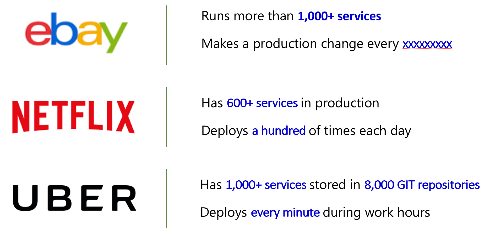
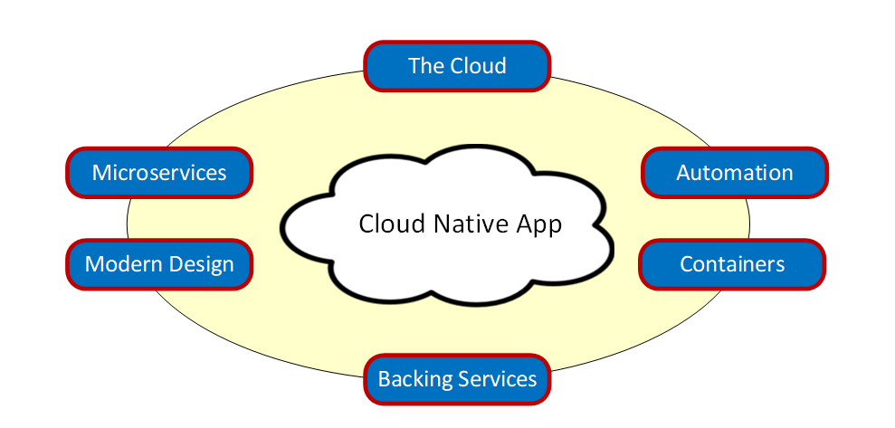
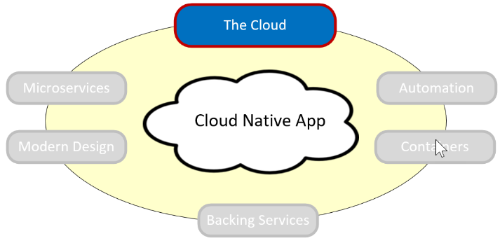

# Defining Cloud Native

Stop what you’re doing, and ping 10 of your colleagues. Ask them to define the term “Cloud Native.” Good chance you’ll get about 8 different answers. What’s even more interesting is that 6 months from now, as technology and cloud native technologies evolve, so will their definition. 

Cloud native is about thinking differently on how we construct and evolve critical business systems - a “modern” way of thinking about system development.

Consider the [definition](https://github.com/cncf/foundation/blob/master/charter.md) from the Cloud Native Computing Foundation:

- Cloud native technologies empower organizations to build and run scalable applications in modern, dynamic environments such as public, private, and hybrid clouds. Containers, service meshes, microservices, immutable infrastructure, and declarative APIs exemplify this approach.
- These techniques enable loosely coupled systems that are resilient, manageable, and observable. Combined with robust automation, they allow engineers to make high-impact changes frequently and predictably with minimal toil.

Applications and their underlying systems have become increasingly complex with users demanding more and more. The new expectation is up-to-the-minute functionality, instant scalability and absolutely no downtime. Performance problems, long-standing errors and the inability to move fast are just not acceptable to the business and to your customers.

Among many things, cloud native is about speed and agility. Business critical systems are evolving from an enabler of business capability to a weapon of strategic transformation, accelerating business velocity and growth. Now, it’s imperative to get ideas to market immediately. In Figure x, shown below, consider three pioneers who have implemented these techniques and ponder the speed, agility and scalability they have achieved.

**Figure 1-1**. Companies embracing Cloud Native Systems

As you can see, eBay, Netflix and Uber expose systems that consist of hundreds of self-contained isolated microservices. Impressively, they can rapidly respond to market conditions by updating specific functionality nearly instantly without having to do a full deployment.

Cloud-native systems can be realigned, reconfigured, and customized faster and easier than ever, which is crucial in a world where the needs of customers continually change.

As we’ll soon see, this new approach to building systems can offer tremendous value to organizations but comes with a high price tag in terms of cost, complexity and management.

At its very core, cloud native applications exhibit several distinct characteristics as show below in Figure 1-2.

**Figure 1-2**. Characteristics of Cloud Native Apps

Realizing that each of the characteristics are key to a cloud native application, let’s take some time to visit each.

## Thinking in terms of the cloud...

Cloud native systems are *all about the cloud*: Born, developed and deployed in the cloud – specifically designed to thrive in a cloud environment. Development teams design these systems from the ground-up in a highly-dynamic, virtualized environment. They are built to exploit the platform and infrastructure capabilities of the cloud delivery model: Elasticity, resilience, redundancy, orchestration and on-demand features.

**Figure 1-3**. The Cloud

The focus moves to *"how"* the application is created and deployed, not so much *"where."*  Cloud native apps make extensive use of PaaS (Platform as a Service) infrastructure and managed services. 

Figure 1-4 depicts the range of the full-featured compute services available in Azure. As you move from the top of the hierarchy to the bottom, your focus shifts away infrastructure plumbing to business functionality. Cloud native systems typically reside at the lower levels of the stack leveraging containers, PaaS and Serverless environments.

**Figure 1-4**. Azure Compute Stack

Cloud native systems typically view the underlying infrastructure as *“disposable”* - provisioned in minutes and resized, scaled, moved or destroyed whenever necessary – all done through automation.

Consider the agreement of *Cattle vs. Pets*. In a traditional data center, servers are treated as Pets. They are typically a physical machine, given a meaningful name and cared for. You scale by adding more resources to the same machine (scaling up). If one becomes sick, it is nursed back to health. When one becomes unavailable, everyone notices.

On the other hand, the Cattle service model is quite different. Provisioned as a virtual machine or container, each virtual instance is identical and assigned an identifier such as Service-01, Service-02, etc. When one has a problem, you automatically replace it with another, i.e., Service-03. When scaling, you “scale out” by creating more of them. When one become unavailable, nobody notices.

The cattle model moves toward immutable infrastructure in which servers are not repaired or modified. If a server fails or requires updating it is destroyed and a new one provisioned – all done via automation.

Cloud native systems assume the infrastructure is dynamic, i.e., the Cattle model, and continue to run as the infrastructure moves, resizes and upgrades. They are able to scale up, down, in or out and move across servers regardless of the machines upon which they are running.
As stated earlier, many companies view the cloud and associated cloud native systems as a competitive advantage – move fast, pivot quickly, expand immediately and fail fast - while reducing operational and hardware costs.

The Azure cloud platform provides a highly elastic infrastructure with a rich set of services, including automatic scaling, self-healing and monitoring capabilities.

## Thinking in terms of the cloud...

>[!div class="step-by-step"]
>[Previous](index.md)
>[Next](candidate-apps-for-cloud-native.md)
