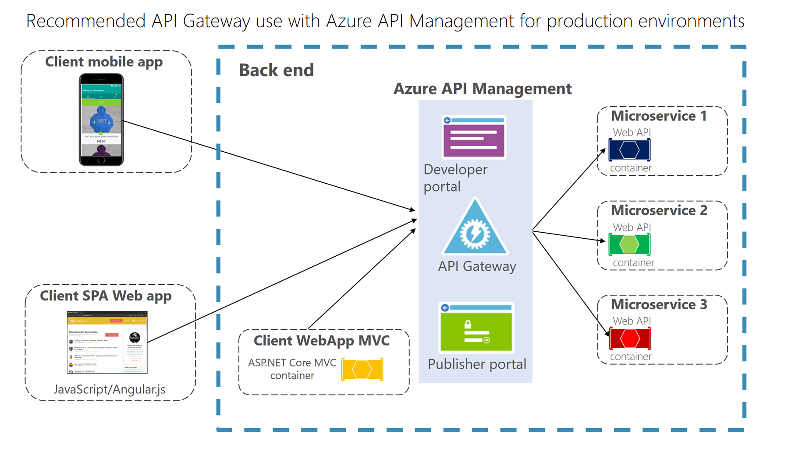

# Mapping eShopOnContainers to Azure Services

Although not required, Azure is very well-suited to supporting the eShopOnContainers because the project was built to be a cloud native application. However, the application is built in a modular fashion so that various services can be configured to use whichever implementation makes the most sense. For instance, in order to support a quick "F5 experience" for new users running the application, the default setup of the applications uses several non-Azure services. This section will examine a variety of features incorporated into the eShopOnContainers application and identify both Azure and local approaches to supporting the functionality.

## API Gateways

The reference application makes use of the API Gateway pattern as well as the Backend-For-Frontend pattern. This protects back end service details from being exposed beyond what's necessary and ensures each front end application has their own customized back end with which to communicate. The sample API gateways in the default solution use [Ocelot, an open source and lightweight API Gateway solution](http://threemammals.com/ocelot). Once deployed, the gateways are essentially their own independent microservices deployed into containers. They can be managed in isolation or configured as part of a Kubernetes cluster.

For production, the app can either continue to use Ocelot, which is used in production by many companies, or if the app requires more functionality and richer features you can substitute Azure API Management services. With Azure API Management, you can configure all of your API gateways from a central location using the built-in developer portal, and consumers of APIs can use the built-in Publisher portal to get information about the services that are available to them. Figure 3-X shows an example of how Azure API Management would integrate into the eShopOnContainers reference architecture.

**Figure 3-X**. eShopOnContainers with Azure API Management.

## SQL Server Databases

The SQL Server databases used by the system are hosted in Docker containers by default, a solution which is only suited to development and testing scenarios. In production, your databases should use highly available (HA) services. The application would ideally communicate with Azure SQL Databases or Azure Cosmos DB. Both of these services provide enterprise level reliability and scalability. Azure SQL Databases provide 99.99 percent availability and up to 100TB databases. Azure Cosmos DB is a globally-distributed multi-modal database which supports a variety of data models including relational, key-value, document, and graph.

## Nonrelational Data Stores

The reference application uses a container-hosted MongoDB instance by default. You can continue to use MongoDB in Azure in production, or you can replace it with another service like Azure Cosmos DB. As noted above, CosmosDB offers HA and is globally-distributed, neither of which is true of your own MongoDB instance hosted in a single container. Since CosmosDB supports the same data access protocol as MongoDB, you can shift from using one in development and test scenarios to the other in production with zero code changes.

## Message Bus

The eShopOnContainers application uses a container-hosted RabbitMQ implementation for local development and testing. For production, it's recommended to instead use Azure Service Bus, with additional consideration paid to error-handling scenarios which are out of scope of the sample. The sample includes implementations of both RabbitMQ and Azure Service Bus event buses, both of which implement a common abstraction defined in the sample (`IEventBus`). It's worth noting that this use of abstraction and swapping of implementations is made possible by the application's use of the [SOLID Principles](https://deviq.com/solid/) and following using [Clean Architecture](https://blog.cleancoder.com/uncle-bob/2012/08/13/the-clean-architecture.html) for the application's architecture.

## Logging and Analytics

The eShopOnContainers app leverages [Serilog](https://serilog.net/) for its structure logging, with Seq as its centralized logging store. Seq supports cloud native applications through their publication of [a Seq implementation running in a Docker container](https://hub.docker.com/r/datalust/seq) which can be used both during development and in production. Centralized logging is critical to being able to diagnose problems that arise within a request that spans many different microservices using both synchronous and message-based communication protocols.

In addition to centralized logging, the app uses Application Insights to track how the application is behaving to a centralized analytics store in Azure. Application Insights can easily be added to any ASP.NET Core application by simply referencing its Nuget package and adding `UseApplicationInsights()` to the application's `WebHostBuilder`, typically in `Program.cs`. For best results in a microservices architecture, the systems should write to a common instance of Application Insights, so a common *instrumentation key* should be provided to every container instance hosting the application. This is exactly what is done in the eShopOnContainers app, in its `docker-compose.override.yml` file. The settings can be defined in a `.env` file or specified as part of the application's Helm charts when deployed to a production environment.

## References

- [Ocelot API Gateway](http://threemammals.com/ocelot)
- [Azure API Management](https://azure.microsoft.com/services/api-management/)
- [SQL Server in Containers](https://docs.microsoft.com/sql/linux/quickstart-install-connect-docker?view=sql-server-2017)
- [Azure SQL Databases](https://azure.microsoft.com/services/sql-database/)
- [Azure Cosmos DB](https://azure.microsoft.com/services/cosmos-db/)
- [MongoDB on Azure](https://docs.mongodb.com/ecosystem/platforms/windows-azure/)
- [RabbitMQ](https://www.rabbitmq.com/)
- [Azure Service Bus](https://azure.microsoft.com/services/service-bus/)
- [Serilog](https://serilog.net/)
- [Seq](https://datalust.co/seq)
- [What is Application Insights](https://docs.microsoft.com/azure/azure-monitor/app/app-insights-overview)

>[!div class="step-by-step"]
>[Previous](introducing-eshoponcontainers-reference-app.md)
>[Next](hosting-the-eshoponcontainers-application.md)
